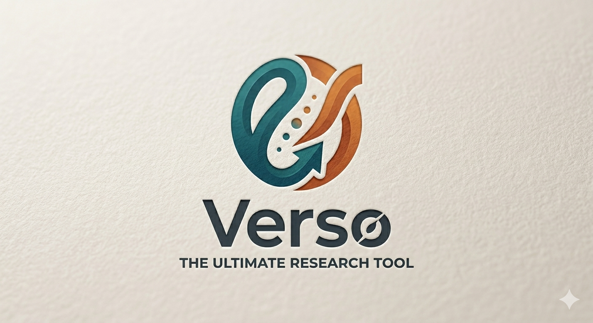

# Verso.py
🔍 Verso AI: Intelligent Research & Citation Engine
Verso AI is a professional-grade research assistant designed to streamline the academic workflow for students and researchers. It combines intelligent source discovery with a high-precision APA 7th Edition citation generator to ensure academic integrity and efficiency.

🚀 Features
Intelligent Search: Provides a multi-perspective analysis of research queries, categorizing results into "Verified Trusted" (e.g., IAEA, Nature) and "Broad Perspectives" (e.g., Reuters, Wikipedia).

Pro Citator: An automated APA 7th Edition generator that extracts data from URLs to create flawless citations in seconds.

Smart Research Dashboard: Features a high-end UI with real-time accuracy metrics and executive summaries.

Adaptive UI: Includes native support for Light Mode and Night Mode to ensure a comfortable research environment at any hour.

🛠️ Technical Stack
Frontend: Streamlit (Python-based web framework)

Styling: Custom CSS (Scribbr-inspired branding & dynamic theme engine)

Logic: Python 3.x

Deployment: Optimized for local hosting or Streamlit Cloud
